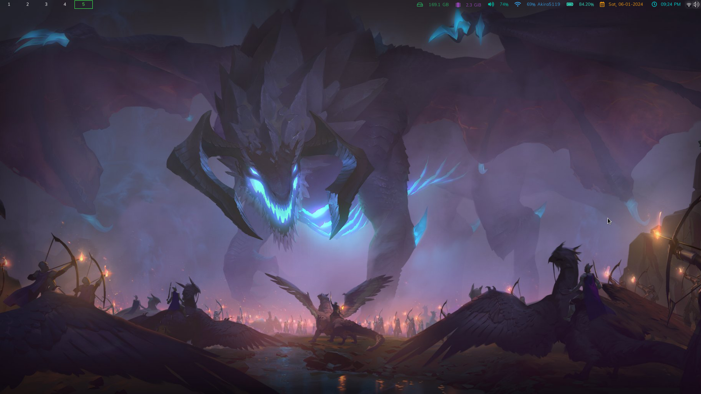

# Dotfiles
Instruções para personalização do Debian 12 com i3wm e xfce4

⚠️ O resultado final foi graças a configurações e tutoriais que eu achei online. Portanto, buscarei atribuir os devidos créditos, identificando cada autor com sua contribuição específica.

a             |   b
:-------------------------:|:-------------------------:
  |  