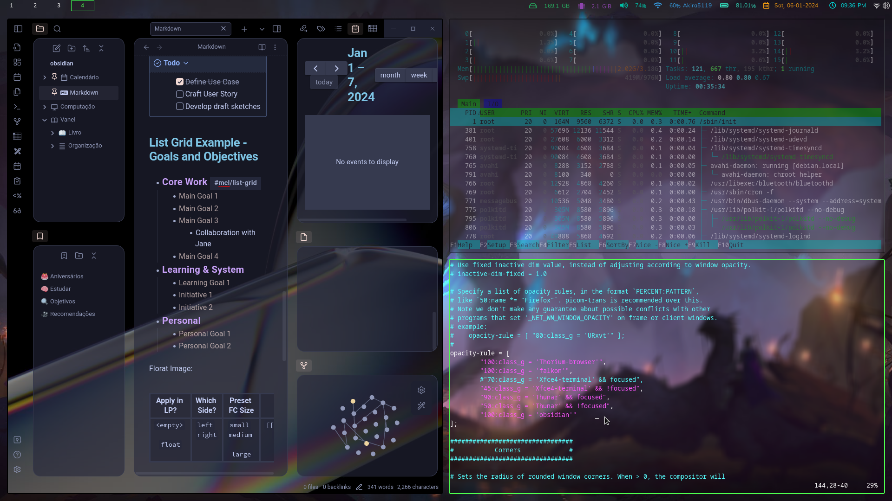

# Dotfiles
Instruções para personalização do Debian 12 com i3wm e xfce4

⚠️ As configurações presentes foram resultado de modificações realizadas ou seguindo tutoriais com precisão. Assim sendo, buscarei atribuir os devidos créditos, identificando cada autor com sua contribuição específica.

🖌️ preview:

